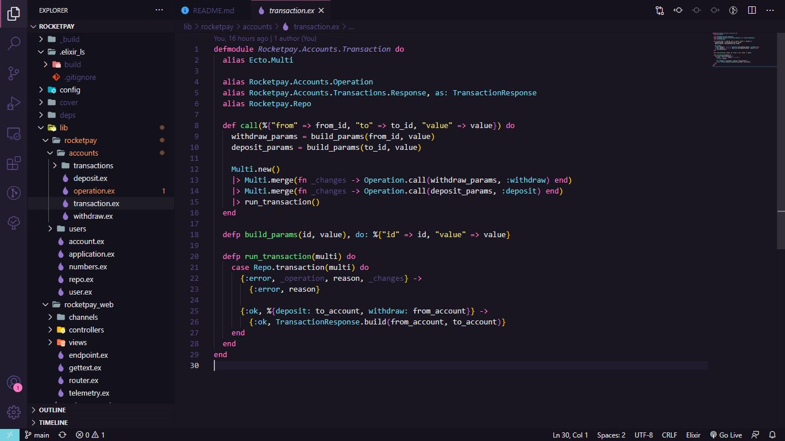

## Rocketpay | [Next Level Week #4 - Rocketseat](https://rocketseat.com.br/)

Rocketpay is an application that simulates a payment API between users in JSON format, making it possible to make deposits, withdrawals and transfers using the nickname (simulating the PicPay).

<!---->

## 📌 Index
- ⚙ [Settings](#-settings)
- 💻 [Technologies](#-technologies)
- 🚀 [How to run](#-how-to-run)
---

## ⚙ Settings
  Follow the environment setup steps at the [link](https://www.notion.so/Configura-es-do-ambiente-Elixir-f823443de76840cbbcb8ab1db8aa4667).
  To the postgresql create the user: admin and password: admin, port: 5432 to the localhost.

## Learn more
  * Official website: https://www.phoenixframework.org/
  * Guides: https://hexdocs.pm/phoenix/overview.html
  * Docs: https://hexdocs.pm/phoenix
  * Forum: https://elixirforum.com/c/phoenix-forum
  * Source: https://github.com/phoenixframework/phoenix

  
  Commands that were used to start the project:
  ## Creating a new directory without html and css (api)
    mix phx.new nlw4_rocketpay --no-webpack --no-html
  ## Creating Credo file
    mix credo gen.config  
---

## 💻 Technologies
    - Elixir (is a dynamic, functional language for building scalable and maintainable applications)
    - Phoenix Framework (is a web framework for the Elixir programming language that gives you peace of mind from development to production)
    - Credo (is a static code analysis tool for the Elixir language with a focus on teaching and code consistency)
    - Pbkdf2 (or Bcrypt to password hashing)
    - ExCoveralls (An Elixir library that reports test coverage statistics, with the option to post to coveralls.io service)
    - PostgreSQL
---

## 🚀 How to run

  > Cloning the repository
  ```bash
    # Cloning repository
    git clone https://github.com/antoniosergiojr/nlw4_rocketpay.git
  ```

  > Running web project
  ```bash
    # Accessing web project
    cd nlw4_rocketpay

    # Install dependencies
    mix deps.get

    # Create and migrate your database
    mix ecto.setup

    # Start Phoenix endpoint
    mix phx.server

    # If you want to run the tests
    mix test --cover
    mix coveralls.html (in 'cover' folder open the file 'excoveralls.html')
    mix test 

    Now you can visit http://localhost:4000 from your browser.
    Phoenix Live Dashboard: http://localhost:4000/dashboard/home.
    
    Open file Insomnia    
    Post create_user http://localhost:4000/api/users
    Post deposit http://localhost:4000/api/accounts/b8e945ef-04a6-4878-9241-3cfc02ba658e/deposit
    Post withdraw http://localhost:4000/api/accounts/b8e945ef-04a6-4878-9241-3cfc02ba658e/withdraw
    Post transaction http://localhost:4000/api/accounts/transaction  
 ```
  Ready to run in production? 
  Please [check our deployment guides](https://hexdocs.pm/phoenix/deployment.html).
    
---


